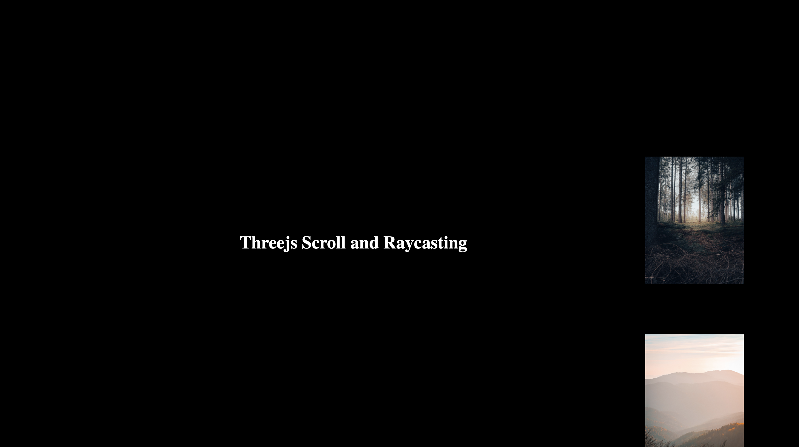

# Three.js Scroll and RayCasting

> This carries two very basic yet important concepts of threejs. One is scroll and other is raycasting.



- Camera
- Geometry
- Materials
- Textures
- Mesh
- Lights
- Renderer
- Debugging with dat.gui

## Built With

- Threejs
- Vite
- Node Package Manager

## Live Demo

[Live Demo Link](https://scroll-threejs.vercel.app)

## Getting Started

To get a local copy up and running follow these simple example steps:

### Setupv

Download [Node.js](https://nodejs.org/en/download/).

##### Run the following commands:

For dependencies

```bash
# Install dependencies (only the first time)
npm install

# Run the local server at localhost:3000
npm run dev

# Build for production in the dist/ directory
npm run build
```

To test your code before pushing it to your repo:

```bash
# To check for any HTML errors
npx hint .

# To check for CSS errors
npx stylelint "**/*.{css,scss}"

# To check for Javascript errors
npx eslint .
```

## Authors

👤 **Author**

- GitHub: [@uzairali19](https://github.com/uzairali19)
- Twitter: [@uzairali751](https://twitter.com/Uzairali751)
- LinkedIn: [LinkedIn](https://www.linkedin.com/in/uzairali19/)

## 🤝 Contributing

Contributions, issues, and feature requests are welcome!

Feel free to check the [issues page](https://github.com/uzairali19/scroll-threejs/issues/).

## Show your support

Please give a ⭐️ if you like this project!

## Acknowledgments

- Shout out to Bruno Simon who has inspired me to follow this path. If you want to learn his extensive course check out. [Threejs Journey](https://threejs-journey.xyz/)

## 📝 License

This project is [MIT](./MIT.md) licensed.
